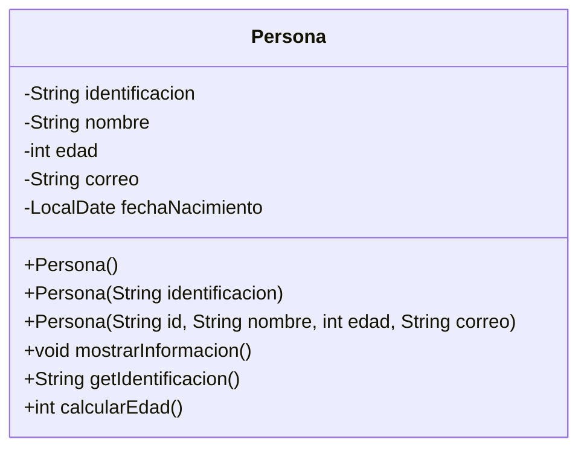

# Diagrama de clase Persona codigo Mermaid



# Diagrama de clases Persona codigo startuml

```
@startuml
class Persona {
	-String identificacion
	-String nombre
	-int edad
	-String correo
	-LocalDate fechaNacimiento
	+Persona()
	+Persona(String identificacion)
	+Persona(String id, String nombre, int edad, String correo)
	+void mostrarInformacion()
	+String getIdentificacion()
	+int calcularEdad()
}
@enduml
```