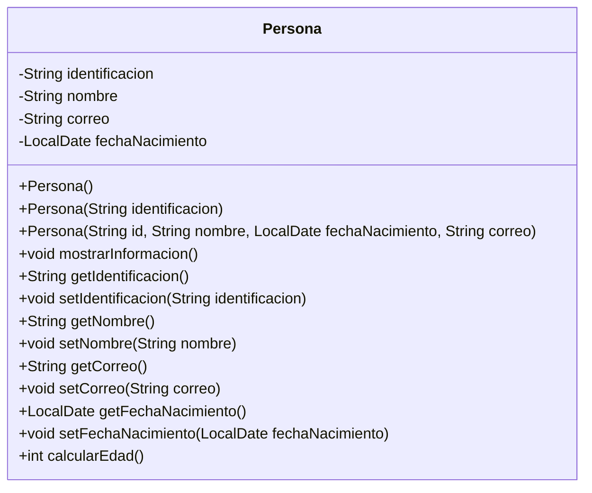
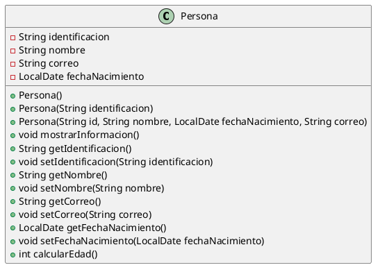

# Diagrama de clase Persona codigo Mermaid

```mermaid
classDiagram
	class Persona {
		-String identificacion
		-String nombre
		-String correo
		-LocalDate fechaNacimiento
		+Persona()
		+Persona(String identificacion)
		+Persona(String id, String nombre, LocalDate fechaNacimiento, String correo)
		+void mostrarInformacion()
		+String getIdentificacion()
		+void setIdentificacion(String identificacion)
		+String getNombre()
		+void setNombre(String nombre)
		+String getCorreo()
		+void setCorreo(String correo)
		+LocalDate getFechaNacimiento()
		+void setFechaNacimiento(LocalDate fechaNacimiento)
		+int calcularEdad()
	}
```

# Diagrama de clases Persona codigo startuml

```plantuml
@startuml
class Persona {
	-String identificacion
	-String nombre
	-String correo
	-LocalDate fechaNacimiento
	+Persona()
	+Persona(String identificacion)
	+Persona(String id, String nombre, LocalDate fechaNacimiento, String correo)
	+void mostrarInformacion()
	+String getIdentificacion()
	+void setIdentificacion(String identificacion)
	+String getNombre()
	+void setNombre(String nombre)
	+String getCorreo()
	+void setCorreo(String correo)
	+LocalDate getFechaNacimiento()
	+void setFechaNacimiento(LocalDate fechaNacimiento)
	+int calcularEdad()
}
@enduml
```